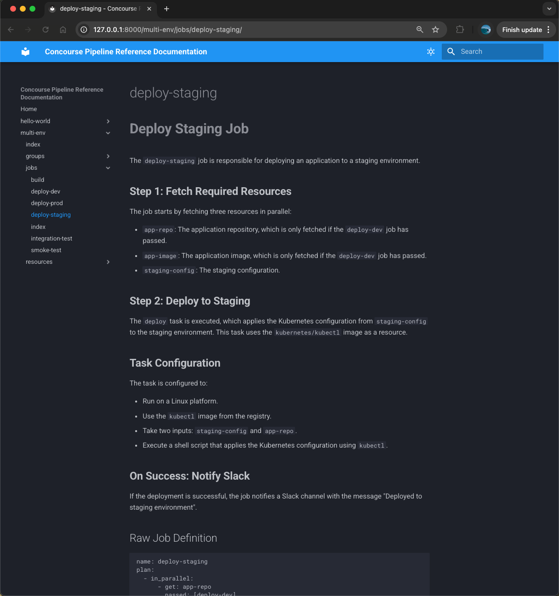

# ConcourseGPT Examples

This directory contains example Concourse pipelines that demonstrate different patterns and use cases. Each example is documented and can be used with ConcourseGPT.

## Directory Structure

- `basic/` - Simple pipelines demonstrating core concepts
- `intermediate/` - More complex patterns for common use cases
- `advanced/` - Production-grade examples with real-world patterns

## Example Pipeline Screenshot


## Running Examples

To generate documentation for any example:

```bash
bin/concourse-gpt generate examples/basic/hello-world.yml
```

To build a complete documentation site for all examples:

```bash
# Generate docs for all examples
for dir in basic intermediate advanced; do
  for f in examples/$dir/*.yml; do
    bin/concourse-gpt generate "$f"
  done
done

# Generate overview README
bin/concourse-gpt gen-readme

# Build and serve the site
bin/concourse-gpt build-site
bin/concourse-gpt serve
```

## Example Categories

### Basic Examples
- `hello-world.yml` - Simple job execution
- `simple-test.yml` - Basic testing pattern

### Intermediate Examples
- `backup.yml` - S3 backup automation
- `test-deploy.yml` - CI/CD workflow with staging and production

### Advanced Examples
- `bbr-backup.yml` - BOSH Backup and Restore automation
- `multi-env.yml` - Multi-environment deployment pattern
